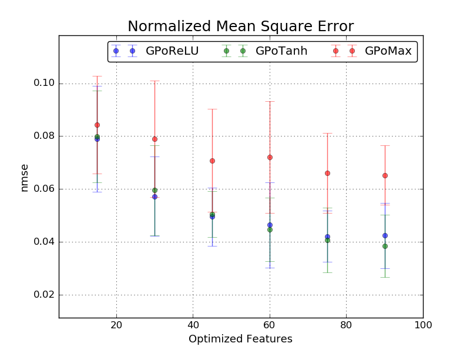
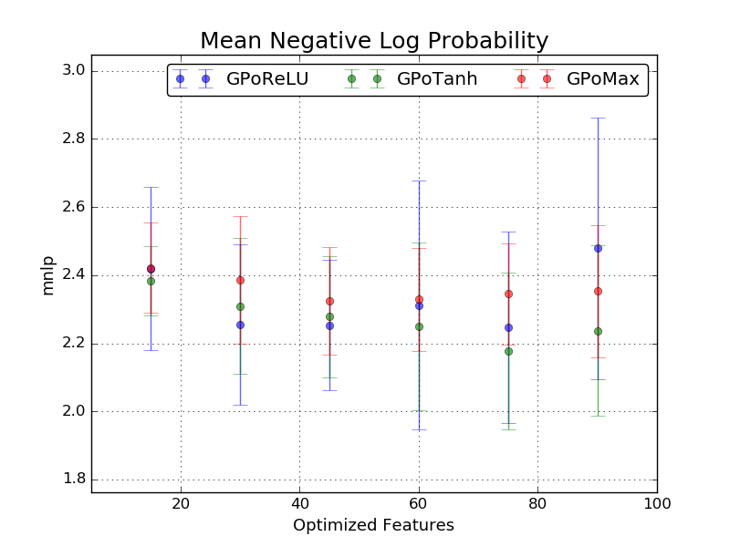
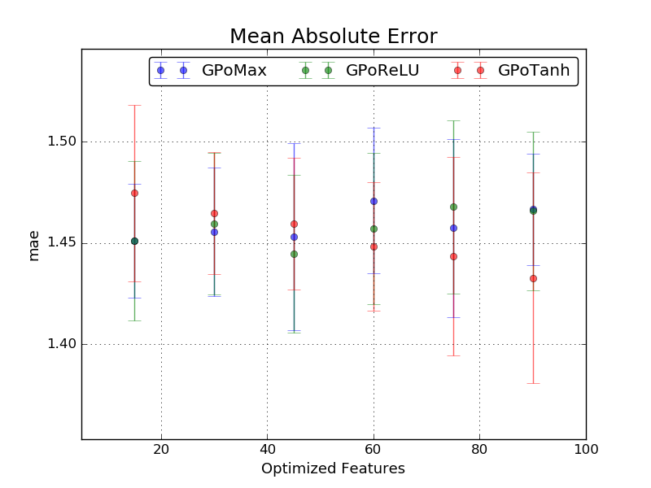
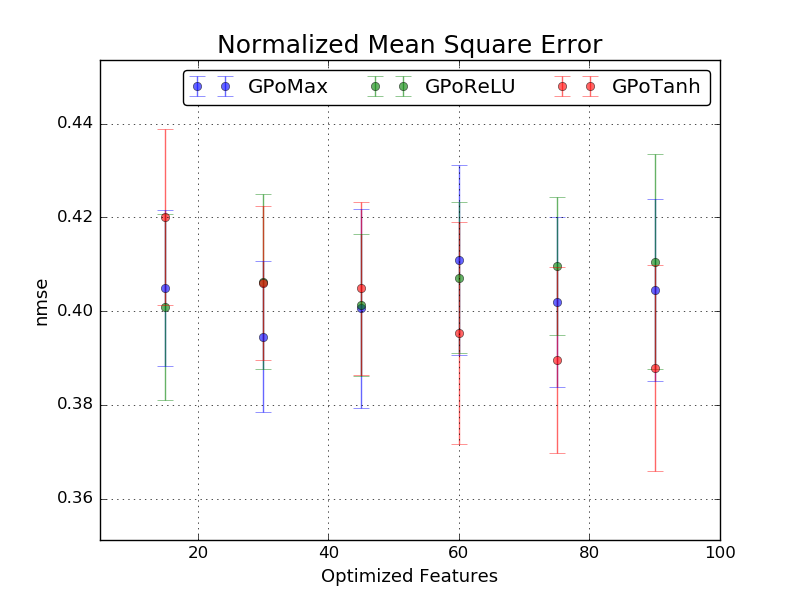
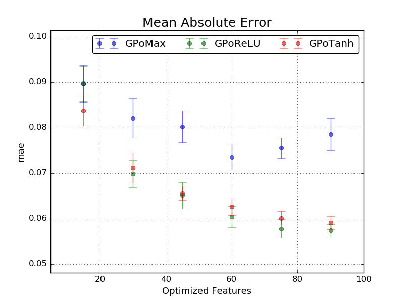
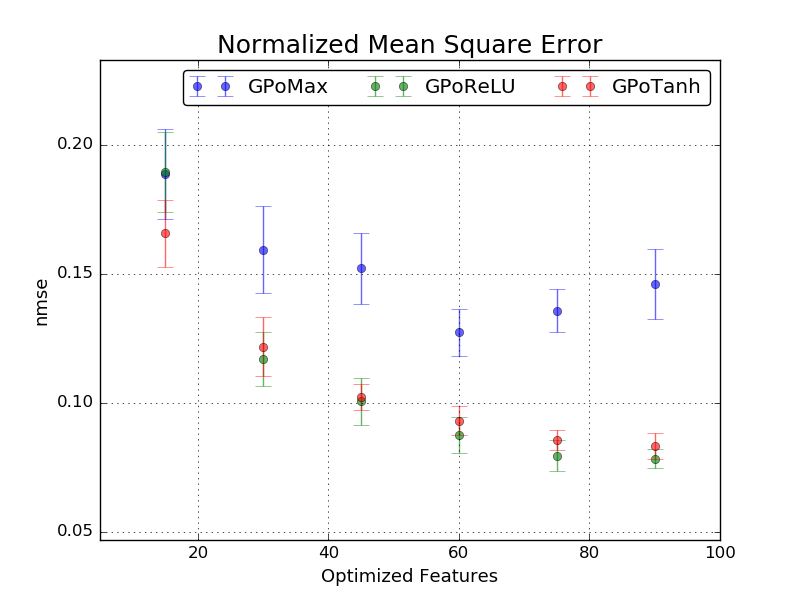

# GPoFM

Gaussian Process Training with Optimized Feature Maps for Shift-Invariant Kernel

## Installation

To install GPoFM, clone this repo:

    $ git clone https://github.com/MaxInGaussian/GPoFM.git
    $ python setup.py install

## Train GPoFM with Different Feature Mapping
```python
from GPoFM import *
use_models = ['GPoMax', 'GPoReLU', 'GPoTanh']
for model_name in use_models:
    ModelClass = getattr(sys.modules['GPoFM'], model_name)
    model = GPoFM(ModelClass(nfeats, resolution, penalty, transform))
    model.optimize(X_train, y_train, funcs, visualizer, **opt_params)
```

## Find the Best Trained GPoFM Model
```python
# fit current dataset to original best trained model
best_model = GPoFM(Model().load(BEST_MODEL_PATH))
best_model.fit(X_train, y_train)
best_model.score(X_test, y_test)
# compare a new trained to original best trained model
model.score(X_test, y_test)
if(model.evals['score'][1][-1] < best_model.evals['score'][1][-1]):
    # save if the new model gives better score
    model.save('best_model.pkl')
```

# Performances on Benchmark Regression Datasets
| Benchmark Dataset | Number of Attributes | Size of Training Data | Size of Testing Data |
| :---: | :---: | :---: | :---: |
| Bostion Housing | 13 | 400 | 106 |
| Abalone | 10 | 3133 | 1044 |
| Kin8nm | 10 | 5000 | 3192 |

<h2 align="left">
Bostion Housing
</h2>





<h2 align="left">
Abalone
</h2>





<h2 align="left">
Kin8nm
</h2>




